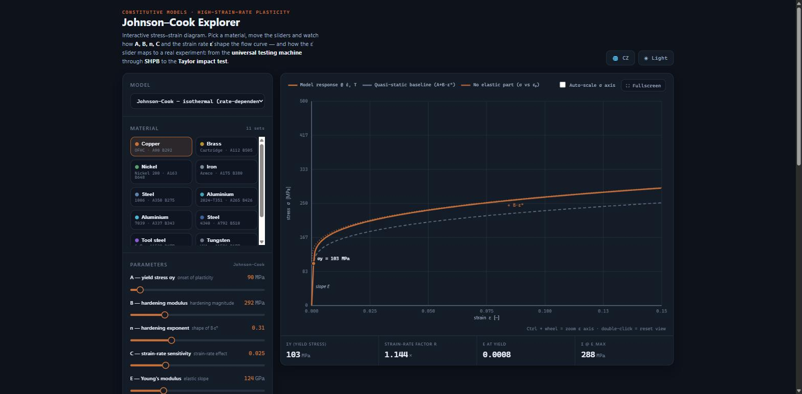
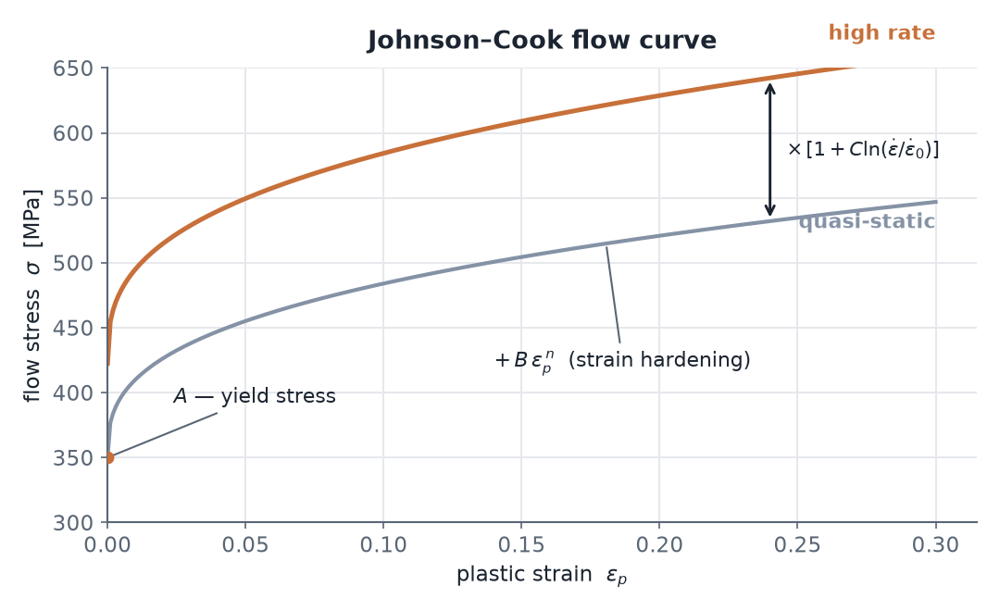
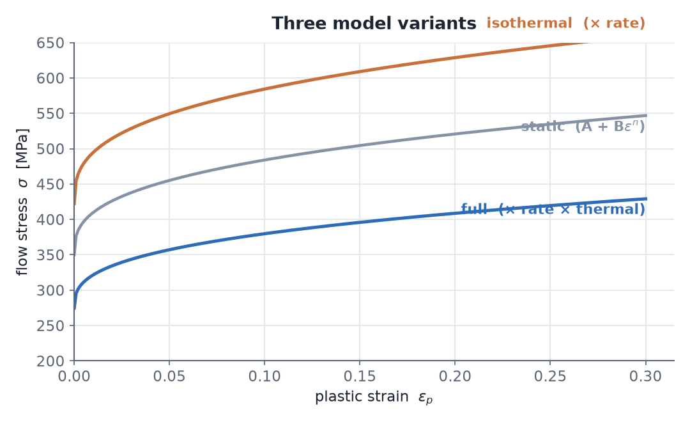
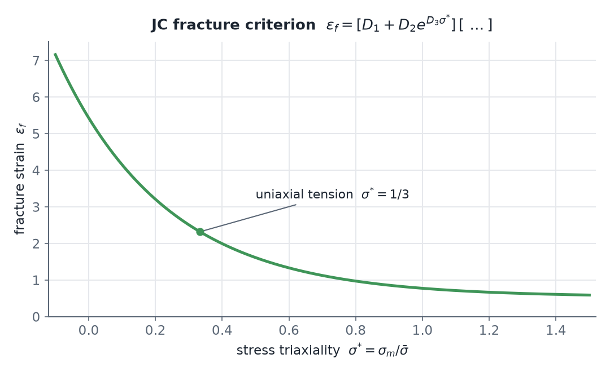

# Johnson–Cook Explorer

**Author:** Jan Zbirovský · [GitHub](https://github.com/zbj3ji/Johnson-Cook-Explorer) · [zbirovsky.com](https://www.zbirovsky.com)

Interactive educational web app for the **Johnson–Cook** constitutive model
(high‑strain‑rate plasticity). Single HTML file, no dependencies — just open
`index.html` in a browser.



*(Česká verze níže / Czech version below.)*

---

## English

### What it shows
- The **stress–strain** diagram σ–ε: the elastic line (slope `E`), yield stress `σy = A·R`,
  plastic hardening `B·εⁿ`, and the effect of strain rate `C`.
- Three curves for comparison: the **model @ the chosen ε̇**, the **quasi‑static baseline (ε̇₀)**,
  and the **pure JC** curve (without the elastic part).
- A **strain‑rate regime strip** that maps the `ε̇` slider to typical experiments:
  quasi‑static (universal testing machine) → **SHPB / Kolsky bar** → **Taylor impact**.

### The Johnson–Cook flow stress
The model splits the flow stress into three multiplicative terms — **strain hardening**,
**strain‑rate** and **thermal softening**:

```
σ = [ A + B·εpⁿ ] · [ 1 + C·ln(ε̇/ε̇₀) ] · [ 1 − T*ᵐ ]
```

- `A` — **yield stress** (onset of plasticity).
- `B`, `n` — **strain hardening** (magnitude and shape of `B·εpⁿ`).
- `C` — **strain‑rate sensitivity**; `R = 1 + C·ln(ε̇/ε̇₀)` is the rate factor that lifts the whole
  curve, with `ε̇₀ = 1 s⁻¹` the reference rate.
- `T* = (T − T₀)/(Tₘ − T₀)`, `m` — **thermal softening** `θ = 1 − T*ᵐ` (`T₀ = 293 K`, `Tₘ` = melting point).



### Three commonly used variants (complex → simplified)
Switch in the **Model** panel; the sliders adapt to the selected variant.

1. **Full (thermomechanical)** — the complete equation above; adds the **T** and **m** sliders.
2. **Isothermal (rate‑dependent)** — `σ = [A + B·εpⁿ]·[1 + C·ln(ε̇/ε̇₀)]` (no temperature).
   Corresponds to `*MAT_SIMPLIFIED_JOHNSON_COOK` in LS‑DYNA. *(default)*
3. **Static (power‑law hardening)** — `σ = A + B·εpⁿ` (no rate, no temperature).



All variants share the elastic branch `σ = E·ε` up to the yield stress `σy`. The grey dashed line
is always the quasi‑static baseline `A + B·εpⁿ`.

### Material failure — JC fracture criterion (1985)
Flow stress is valid only up to fracture. The **Failure** panel adds the **Johnson–Cook fracture
criterion**, which gives the fracture strain `εf` as a function of stress triaxiality `σ*`, strain
rate and temperature:

```
εf = [D1 + D2·exp(D3·σ*)] · [1 + D4·ln(ε̇*)] · [1 + D5·T*]
```

`σ*` = stress triaxiality (`= 1/3` for uniaxial tension); `D1…D5` = fracture parameters. The app
computes `εf`, marks the **fracture limit** on the curve and greys out the region beyond it
(“equation no longer valid”). Failure strain **drops sharply with increasing triaxiality**:



`D1…D5` are published for copper (OFHC), steel 4340, aluminium 2024‑T351 and Ti‑6Al‑4V; the rest
are **illustrative** — replace with your own data.

### Controls
- **Material** — 11 representative JC sets (copper, brass, nickel, iron, steels, aluminium alloys,
  tool steel S‑7, tungsten, Ti‑6Al‑4V). Values from Johnson & Cook 1983 and derived sources.
- **Sliders** — `A, B, n, C, E, ε̇ (log), ε_max`.
- **σ‑axis auto‑scale** — off by default (axis frozen); tick the checkbox to let it follow the data.
- **Ctrl + mouse wheel** = zoom the ε axis · **double‑click** = reset the view (plain wheel scrolls the page).
- **Fullscreen** · **Save PNG** (plot with a parameter header) · **Reset material / view** ·
  light/dark theme · **CZ / EN language toggle**.

### Adding further models
Constitutive models live in the `MODELS` object; material sets in `MATERIALS`. Adding another model
(Zerilli–Armstrong, Cowper–Symonds…) = add one entry and unlock it in `<select id="model">`.

> ⚠️ The preset values are representative literature sets; in practice they vary with batch and
> source. Do not treat them as definitive material data.

---

## Čeština

Interaktivní výuková aplikace ke konstitutivnímu modelu **Johnson–Cook** (plasticita za vysokých
rychlostí deformace). Jeden HTML soubor, žádné závislosti — otevři `index.html` v prohlížeči.

### Co ukazuje
- Diagram **napětí–deformace** σ–ε: elastická přímka (sklon `E`), mez kluzu `σy = A·R`,
  plastické zpevnění `B·εⁿ`, vliv rychlosti deformace `C`.
- Tři křivky pro porovnání: **model @ zvolené ε̇**, **kvazistatický základ (ε̇₀)** a **čistá JC**
  (bez elastické části).
- **Pruh režimů rychlosti** propojující posuvník `ε̇` s typickými experimenty:
  kvazistatika (univerzální zkušební stroj) → **SHPB / Kolského tyč** → **Taylorův ráz**.

### Tokové napětí Johnson–Cook
Model rozkládá tokové napětí na tři násobené členy — **deformační zpevnění**, **rychlostní** člen
a **tepelné změkčení**:

```
σ = [ A + B·εpⁿ ] · [ 1 + C·ln(ε̇/ε̇₀) ] · [ 1 − T*ᵐ ]
```

- `A` — **mez kluzu** (počátek plasticity).
- `B`, `n` — **deformační zpevnění** (velikost a tvar `B·εpⁿ`).
- `C` — **rychlostní citlivost**; `R = 1 + C·ln(ε̇/ε̇₀)` je rychlostní faktor, který zvedá celou
  křivku, `ε̇₀ = 1 s⁻¹` je referenční rychlost.
- `T* = (T − T₀)/(Tₜ − T₀)`, `m` — **tepelné změkčení** `θ = 1 − T*ᵐ` (`T₀ = 293 K`, `Tₜ` = teplota tání).


### Tři běžně používané varianty (od komplexní po zjednodušenou)
Přepínač v panelu **Model**; posuvníky se přizpůsobí zvolené variantě.

1. **Úplný (termomechanický)** — kompletní rovnice výše; přidá posuvníky **T** a **m**.
2. **Izotermický (rychlostní)** — `σ = [A + B·εpⁿ]·[1 + C·ln(ε̇/ε̇₀)]` (bez teploty).
   Odpovídá `*MAT_SIMPLIFIED_JOHNSON_COOK` v LS‑DYNA. *(výchozí)*
3. **Statický (mocninné zpevnění)** — `σ = A + B·εpⁿ` (bez rychlosti i teploty).


Všechny varianty sdílejí elastiku `σ = E·ε` do meze kluzu `σy`. Šedá čárkovaná je vždy
kvazistatický základ `A + B·εpⁿ`.

### Porušení materiálu — JC kritérium (1985)
Tokové napětí platí jen do porušení. Panel **Porušení** přidá **kritérium porušení Johnson–Cook**,
které dává deformaci při lomu `εf` v závislosti na triaxialitě napětí `σ*`, rychlosti deformace a
teplotě:

```
εf = [D1 + D2·exp(D3·σ*)] · [1 + D4·ln(ε̇*)] · [1 + D5·T*]
```

`σ*` = triaxialita napětí (`= 1/3` pro jednoosý tah); `D1…D5` = parametry porušení. Aplikace spočítá
`εf`, na křivce vyznačí **mez lomu** a za ní oblast zašedí („rovnice neplatí"). Deformace při lomu
**prudce klesá s rostoucí triaxialitou**:


`D1…D5` jsou publikované pro měď (OFHC), ocel 4340, hliník 2024‑T351 a Ti‑6Al‑4V; ostatní jsou
**ilustrativní** — nahraď svými daty.

### Ovládání
- **Materiál** — 11 reprezentativních JC sad (měď, mosaz, nikl, železo, oceli, hliníky,
  nástrojová ocel S‑7, wolfram, Ti‑6Al‑4V). Hodnoty dle Johnson & Cook 1983 a odvozené.
- **Posuvníky** — `A, B, n, C, E, ε̇ (log), ε_max`.
- **Automatické měřítko osy σ** — defaultně vypnuté (osa zamrzlá); zapneš zaškrtnutím checkboxu.
- **Ctrl + kolečko myši** = zoom osy ε · **dvojklik** = reset pohledu (samotné kolečko scrolluje stránku).
- **Celá obrazovka** · **Uložit PNG** (graf s hlavičkou parametrů) · **Reset materiálu / pohledu** ·
  světlý/tmavý motiv · **přepínač jazyka CZ / EN**.

### Rozšíření o další modely
Konstitutivní modely jsou v objektu `MODELS`, materiálové sady v `MATERIALS`. Přidání dalšího modelu
(Zerilli–Armstrong, Cowper–Symonds…) = doplnit jednu položku a odemknout ji v `<select id="model">`.

> ⚠️ Přednastavené hodnoty jsou reprezentativní literární sady; v praxi se liší dle šarže a zdroje.
> Neber je jako definitivní materiálová data.
